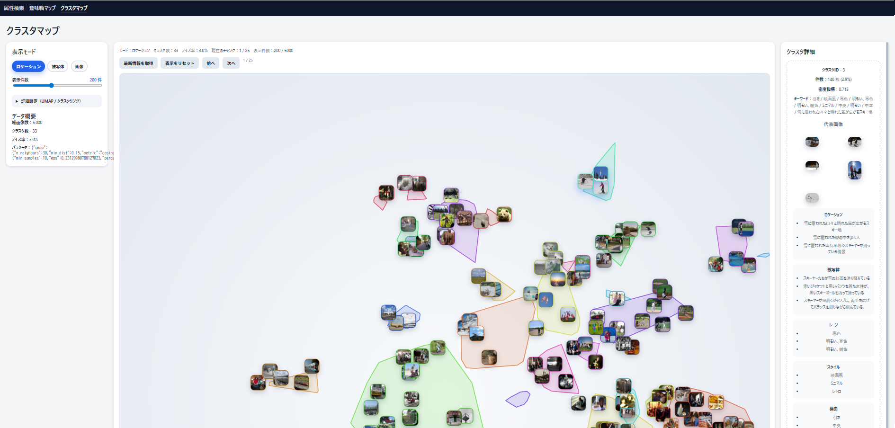

# PhotoCategorizer

属性テキストと画像ベクトルを組み合わせて **大規模な写真コレクションを直感的に探索・分析** するためのツールキットです。

通常の画像検索は「画像全体を1つのベクトル」に変換して類似度を計算しますが、PhotoCategorizer ではそれに加えて：

* **ロケーション (location)** と **被写体 (subject)** を **日本語自然文（50〜100文字）** で記述し、
* それをテキスト埋め込みベクトル化して検索やマップ配置に利用します。

これにより単純な外見の類似だけでなく、**意味的に豊かな検索・散布図・クラスタリング** が可能になります。たとえば：

* *「夕暮れの都会の交差点」* のような自然文検索
* 「屋外 ↔ 屋内」「人物 ↔ 物体」といった **意味軸マップ** の対比
* **UMAP+クラスタリング** による群の全体構造の把握

といった探索が可能です。

---

## 技術的な工夫

* **属性抽出**: ローカルLLMを利用し、画像から自然文属性 + カテゴリタグを抽出。

  * [`qwen/qwen2.5-vl-7b`](https://huggingface.co/Qwen)（LM Studio 経由）で location / subject を自然文生成
  * tone / style / composition は定義済みタグを JSON で付与
* **検索エンジン**: FAISS + SQLite によるハイブリッド検索

  * location/subject は [`text-embedding-embeddinggemma-300m-qat`] による埋め込みでベクトル検索
  * tone/style/composition はタグフィルタ（AND/OR 組み合わせ）
* **可視化**:

  * 語ペア軸の散布図（意味軸マップ）: 自然文からの埋め込みやOpenCLIP を用いた画像埋め込みを軸に投影
  * UMAP + DBSCAN クラスタマップ（代表画像・属性要約表示）

すべてローカル環境で動作し、クラウドAPIに依存せずに **大規模データセットのベクトルベース探索** が可能です。

---

## 画面イメージ

**属性検索 UI** – 自然文検索 + タグフィルタで探索。詳細モーダルから類似検索へジャンプ。


**意味軸マップ** – 任意の語ペアを軸にしてサムネイル散布。


**クラスタマップ** – UMAP座標 + クラスタリングで全体像を俯瞰。



---

---

## クイックスタート

### 1. 環境構築

```bash
python -m venv .venv
source .venv/bin/activate
pip install -r requirements.txt
```

LM Studio 等でビジョンモデル（例: `qwen/qwen2.5-vl-7b`）を提供し、`.env` か環境変数で `LMSTUDIO_BASE_URL` と `LMSTUDIO_API_KEY` を設定してください。

### 2. 属性抽出（バッチ処理）

`photocat.cli attr-poc` で画像フォルダから属性 JSON を生成します。大規模データはオフセットを変えて繰り返し実行します。

```bash
# 例: 1000 枚ずつ 5 バッチに分割
for i in 0 1000 2000 3000; do
  venv/bin/python -m photocat.cli attr-poc data/val2017 \
    --offset "$i" --limit 1000 \
    --use-qwen --no-use-gemma \
    --out-dir outputs/attr_poc_batches/batch_$(printf "%04d" "$i")
done

# 末尾 500 枚など残りは limit を調整
venv/bin/python -m photocat.cli attr-poc data/val2017 \
  --offset 4000 --limit 500 \
  --out-dir outputs/attr_poc_batches/batch_4000
```

バッチで生成した `attr_results.json` は次のように統合します。

```bash
venv/bin/python - <<'PY'
import json
from pathlib import Path

parts = sorted(Path('outputs/attr_poc_batches').glob('batch_*/attr_results.json'))
records = []
for path in parts:
    records.extend(json.loads(path.read_text(encoding='utf-8')))

out = Path('outputs/attr_poc_full/attr_results.json')
out.parent.mkdir(parents=True, exist_ok=True)
out.write_text(json.dumps(records, ensure_ascii=False, indent=2), encoding='utf-8')
print(f'Merged {len(records)} records -> {out}')
PY
```

### 3. インデックス構築

```bash
venv/bin/python -m photocat.cli attr-index outputs/attr_poc_full/attr_results.json --reset
```

これにより `outputs/vector_index/` に FAISS インデックス、サムネイル、属性 SQLite が生成されます。

### 4. （任意）クラスタマップ用の前処理

```bash
venv/bin/python -m photocat.cli cluster-precompute --index-dir outputs/vector_index
```

`outputs/vector_index/clusters/<mode>/` に UMAP 座標・クラスタラベル・境界ポリゴンが保存され、クラスタマップ画面で利用できます。

### 5. Web UI の起動

```bash
venv/bin/python -m photocat.cli attr-serve --host 0.0.0.0 --port 8000
```

ブラウザで `http://localhost:8000` を開き、以下のタブを切り替えて利用します。

- **属性検索** – フリーワードと属性重みの組み合わせ検索、詳細モーダル表示。
- **意味軸マップ** – 語ペア軸を設定して散布図を生成。ズーム・ドラッグ・詳細表示が可能。
- **クラスタマップ** – 事前計算した座標を読み込み、クラスタ概要と代表画像を確認。

Windows で UI だけ試す場合は `launch_attr_ui.bat` から同等のコマンドを実行できます。

## ディレクトリ構成（抜粋）

```
photocat/          # FastAPI サーバーと CLI 実装
  attr_poc.py      # 属性抽出ワークフロー
  attr_index.py    # インデックス構築・検索ロジック
  cluster_precompute.py  # UMAP + クラスタ計算
templates/         # 属性検索 / 意味軸マップ / クラスタマップの HTML
outputs/
  attr_poc_batches/   # バッチごとの属性 JSON
  attr_poc_full/      # 統合済み属性 JSON
  vector_index/       # インデックス・サムネイル・クラスタ成果物
legacy/
  zero-shot/          # 旧ゼロショット分類バッチ（start.bat など）
```

## 追加メモ

- 属性抽出プロンプトの仕様やタグ一覧は `docs/属性抽出・検索仕様書.md` を参照してください。
- クラスタマップ／意味軸マップの UI 仕様は `docs/クラスタマップUI仕様書（UMAP + クラスタリング）.md` と `docs/散布図UI仕様書（語ペア軸ビュー）.md` にまとめています。

## レガシー: ゼロショット分類バッチ

従来の `photocat.cli eval` を Windows バッチで回す仕組みは `legacy/zero-shot/` に移動しました。必要な場合のみ参照してください。
